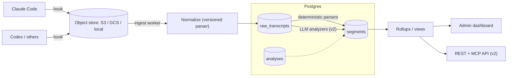
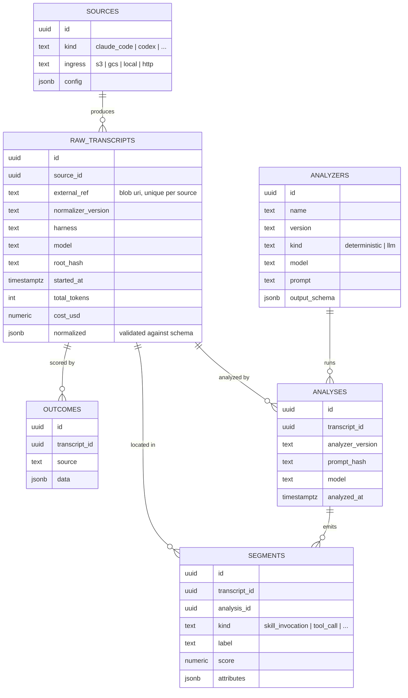
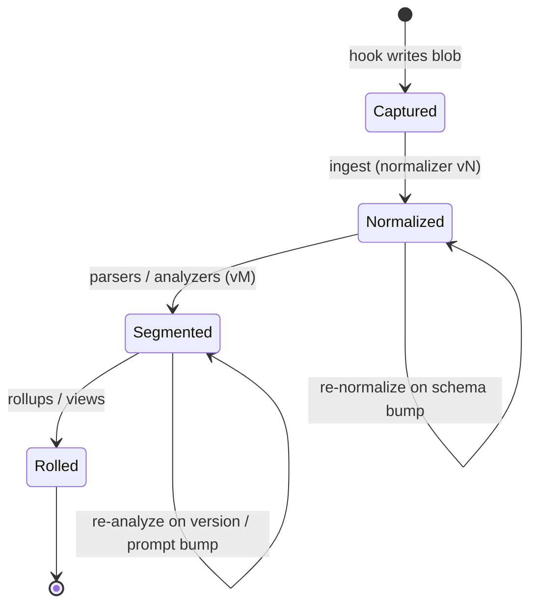
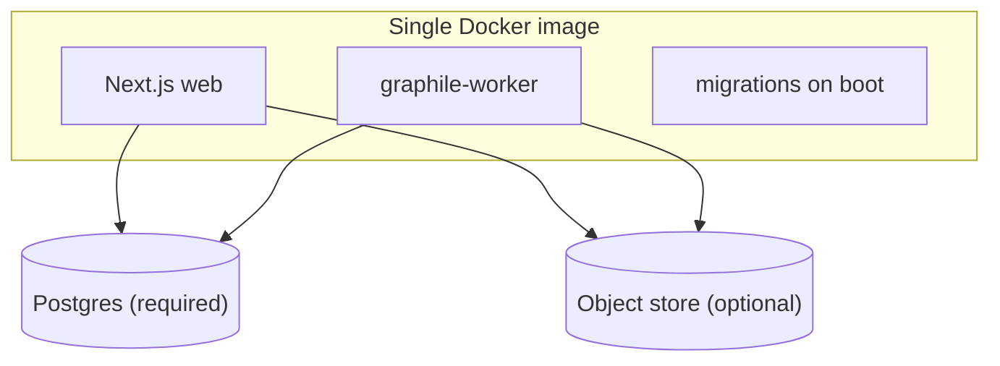

# Switchboard Architecture

> **This is the canonical architecture reference. Start here.** It is intentionally
> pithy — diagrams and data-model notes over prose. The _why_ behind these choices
> lives in [philosophy.md](./philosophy.md).

Switchboard ingests coding-agent transcripts (Claude Code, Codex, …), normalizes
them into one versioned format, and analyzes them so an org can see how its agents
are used — skills, MCP tool calls, cost — and ultimately swap models/harnesses to
cut token spend.

## System

- **Hook** — a separately distributed package that pipes each agent session to an
  object store the user controls. It's the wedge; we never own the ingestion edge.
  Destinations (S3 / GCS / local FS / HTTP) sit behind one interface.
- **Ingest + normalize** — a worker pulls raw blobs and runs the
  source-appropriate, independently versioned parser to produce a standardized
  transcript. New agent → new parser; format change → version bump.
- **Analyze** — analyzers read normalized transcripts and emit **segments**
  (labeled chunks: skill invocation, tool call, MCP tool call, error, …).
  Deterministic parsers and LLM analyzers share one schema; the MVP ships
  deterministic-only and makes **no LLM calls**.
- **Serve** — rollup tables/views feed the admin dashboard (MVP) and a REST + MCP
  API (v2). At our scale (100s–1000s/day) **Postgres is the queue** (`FOR UPDATE
  SKIP LOCKED`): no Kafka, Redis, or external orchestrator.

## Data model

Notes that matter more than the columns:

- **The normalized schema is the contract.** `raw_transcripts.normalized` is
  **versioned, published as a JSON Schema, and validated on write** so third
  parties can write their own parsers. Analysis _dimensions_ (model, harness, root
  hash, timing, cost, tokens) are **promoted to indexable columns**, not buried in
  JSON.
- **Analysis is append-only and version-tagged.** A uniqueness constraint on
  `(transcript_id, analyzer_version, prompt_hash, model)` makes re-runs idempotent
  (`ON CONFLICT DO NOTHING`) and turns any prompt/version change into _new_ rows
  beside the old — free A/B comparison and a full audit trail. We never overwrite.
- **`segments` is one shared table** for deterministic parsers (MVP) and external
  posters (v2). It powers the skills leaderboard, MCP tool analysis, and cost
  views with the same shape.
- **`sources` and `analyzers` are data, not code** — changing a prompt or adding a
  source never requires a redeploy.
- A lightweight `pipeline_runs` table records lineage (who ran, what version, how
  many processed, errors).

## Lifecycle of a transcript

Store the raw normalized JSON forever; **migrate forward to the latest schema on
read.** Old schema versions exist only to decode historical rows; new writes always
use the latest. Re-runs (the self-loops above) are the universal upgrade mechanism.

## Stack

| Concern   | Choice |
|-----------|--------|
| Language  | Full-stack TypeScript, one repo |
| Web       | Next.js (App Router), "RSC-lite" — server components as thin data shells, client owns interactivity, no Server Actions |
| Engine    | [Effect](https://effect.website) for parsers / workers / schemas / API; plain TS at the edges |
| Data      | Postgres (the only required dependency) via Drizzle ORM |
| Jobs      | graphile-worker (Postgres-backed), handlers wrapped as Effect programs |
| API (v2)  | `@effect/platform` HttpApi — schema-first, emits OpenAPI; MCP is another adapter |
| Dashboard | Tailwind + shadcn/ui + Tremor |
| Auth      | Admin-only: env-var password + scoped, revocable service tokens |

Deliberately skipped: dbt, workflow orchestrators, external queues, multi-tenancy,
Kubernetes.

## Deployment

One image (web + worker selectable by command, or in-process for the simplest
deploy); Postgres is a dependency, not a component. `docker compose up` bundles
Postgres to try it; a prod compose file expects an external `DATABASE_URL`. The app
refuses to start in production with default secrets.

**Public OSS product repo + private infra-only repo.** The product is public; our
own instance deploys from a private IaC repo that pulls the published image. Staging
and prod run the **same image artifact**, differing only by tag (`:main` vs a pinned
release) and env/DB. (Why, and how internal-only features stay out of a fork:
[philosophy.md](./philosophy.md).)

## Roadmap

- **MVP** — hook + ingestor + deterministic parsers; admin dashboard (transcript
  list filterable by user/date/harness/model, single-transcript view, skills
  leaderboard, MCP tool analysis, cost views). No LLM calls.
- **v2** — REST + MCP API; externally-posted segments/analyses (BYOK or posted from
  another system); outcome data with per-model / per-root / per-harness /
  per-period breakdowns for config experiments.
- **v3** — a recommendations engine, with deeper internal-system integration
  ("Enterprise"), built behind the extension seam planned for now.
