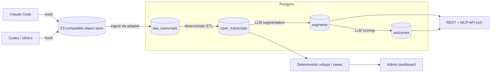
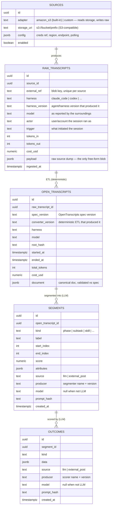
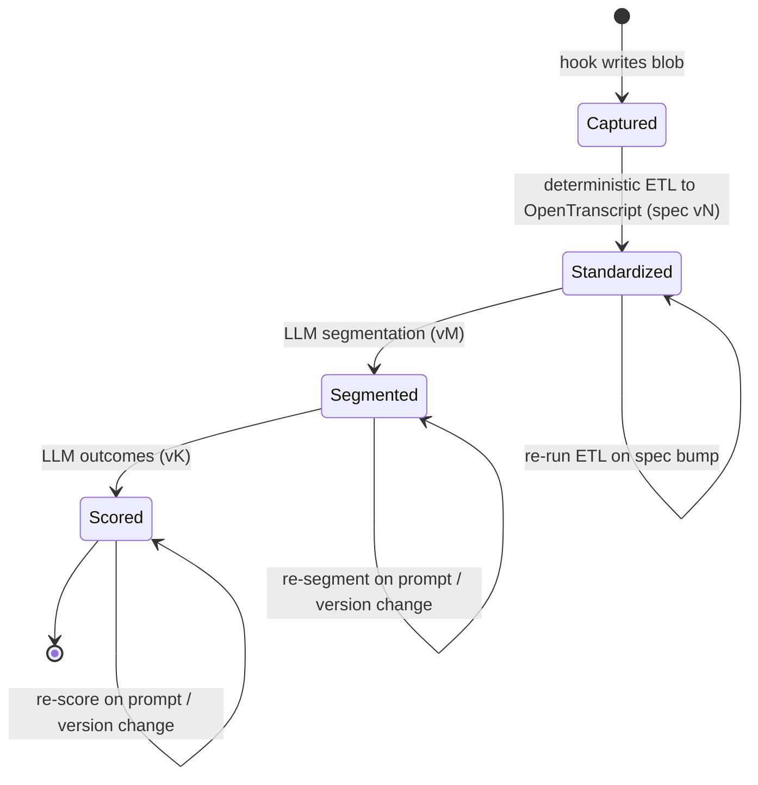
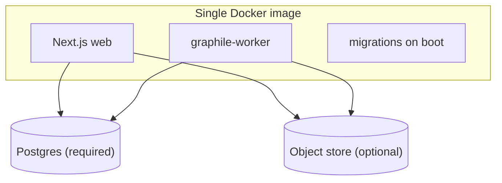

# Switchboard Architecture

> **This is the canonical architecture reference. Start here.** It is intentionally
> pithy — diagrams and data-model notes over prose. The _why_ behind these choices
> lives in [philosophy.md](./philosophy.md).

Switchboard ingests coding-agent transcripts (Claude Code, Codex, …), standardizes
them into one versioned canonical format (the **OpenTranscripts spec**), and
analyzes them so an org can see how its agents are used — skills, MCP tool calls,
cost — and ultimately swap models/harnesses to cut token spend.

## System

The data moves through four stages, with one hard determinism boundary in the
middle: **raw → OpenTranscript is a deterministic ETL; OpenTranscript → segments →
outcomes are LLM-driven.**

- **Hook** — a separately distributed package that pipes each agent session to an
  object store the user controls. It's the wedge; we never own the ingestion edge.
  Destinations (S3 / GCS / local FS / HTTP) sit behind one interface.
- **Ingest (raw)** — a per-source **adapter** pulls blobs from S3-like storage into
  `raw_transcripts`: the source payload preserved verbatim, plus sidecar metadata
  about the surroundings (who ran it, the trigger, the model, token usage, harness +
  version). We ship an **Amazon S3** adapter out of the box; transcripts shaped some
  other way get a custom adapter that writes the same table. Faithful capture,
  nothing interpreted.
- **Standardize (OpenTranscripts)** — a **deterministic**, source-appropriate,
  independently versioned converter translates each raw transcript into the
  canonical **OpenTranscripts** format, computing declared fields like total tokens
  and cost. New agent → new converter; spec change → version bump.
- **Segment then score (LLM-driven)** — segmentation reads an OpenTranscript and
  emits **segments** (labeled spans); scoring reads segments and emits **outcomes**.
  Both steps are LLM-driven (or externally posted) and land in v2; the MVP makes
  **no LLM calls**.
- **Serve** — deterministic rollups/views over `open_transcripts` feed the admin
  dashboard (MVP); segments and outcomes feed a REST + MCP API (v2). At our scale
  (100s–1000s/day) **Postgres is the queue** (`FOR UPDATE SKIP LOCKED`): no Kafka,
  Redis, or external orchestrator.

## Data model

Notes that matter more than the columns:

- **`raw_transcripts` is a faithful capture, not an interpretation.** The raw source
  dump lives in `payload` — the _only_ free-form JSONB — alongside **promoted sidecar
  columns** the adapter knows about the surroundings even when the payload doesn't
  state them structurally: `harness` + `harness_version`, `model`, `actor`, `trigger`,
  and token/cost usage. Capturing surroundings is not analyzing — nothing here is
  segmented or scored. It is the immutable source of truth; everything downstream is
  regenerated from it. (The promoted set will grow as we learn what's worth indexing;
  the rule is that anything structural earns a column and only the payload stays raw.)
- **Raw sidecar vs. canonical fields.** `raw_transcripts` records what the adapter
  _observed_ at capture; `open_transcripts` re-derives the canonical, spec-validated
  `model` / `harness` / timing / tokens / cost _deterministically from the payload_.
  Raw is what we saw; open is what we standardized.
- **The OpenTranscripts spec is the contract.** `open_transcripts.document` is
  **versioned, published as a JSON Schema, and validated on write** so third parties
  can target one canonical format. The dimensions we slice by (model, harness, root
  hash, timing, tokens, cost) are **promoted to indexable columns**, not buried in
  JSON. Raw → OpenTranscript is fully deterministic, tagged with `converter_version`.
- **Outcomes attach to segments, never to transcripts.** An outcome is always a
  judgment about a specific segment; per-transcript views roll up from there.
- **No separate `analyzers` / `analyses` tables.** Because segmentation and scoring
  are the only LLM steps and share one shape, provenance lives _inline_ on
  `segments` and `outcomes`: `source` (llm vs externally posted), `producer`
  (name + version), `model`, and `prompt_hash`. This keeps analysis append-only and
  version-tagged — a uniqueness constraint over `(parent_id, producer, prompt_hash,
  model, kind)` (where `parent_id` is `open_transcript_id` for segments and
  `segment_id` for outcomes) makes re-runs idempotent (`ON CONFLICT DO NOTHING`) and turns any
  prompt/version change into _new_ rows beside the old (free A/B, full audit) — and
  lets external systems POST through the same columns.
- **Deterministic insights come from `open_transcripts` directly.** The skills
  leaderboard, MCP tool-call analysis, and cost views are rollups/views over the
  canonical document — no LLM. Segments and outcomes are the LLM-driven layer above.
- **`sources` is data, not code.** A source is an S3-compatible `storage_uri` plus an
  `adapter` that reads it and writes `raw_transcripts`. We ship a built-in **Amazon S3**
  adapter; anyone whose transcripts are shaped differently writes their own adapter (or
  posts straight into `raw_transcripts`). Adding a source never requires a redeploy.
- A lightweight `pipeline_runs` table records lineage (who ran, what version, how
  many processed, errors).

## Lifecycle of a transcript

`raw_transcripts` is kept forever as the immutable source of truth; the
OpenTranscript is **regenerated deterministically** whenever the spec bumps, and
segments/outcomes are re-derived when a prompt or version changes. Re-runs (the
self-loops above) are the universal upgrade mechanism — append new version-tagged
rows, never overwrite.

## Stack

| Concern   | Choice |
|-----------|--------|
| Language  | Full-stack TypeScript, one repo |
| Web       | Next.js (App Router), "RSC-lite" — server components as thin data shells, client owns interactivity, no Server Actions |
| Engine    | [Effect](https://effect.website) for parsers / workers / schemas / API; plain TS at the edges |
| Data      | Postgres (the only required dependency) via Drizzle ORM |
| Jobs      | graphile-worker (Postgres-backed), handlers wrapped as Effect programs |
| API (v2)  | `@effect/platform` HttpApi — schema-first, emits OpenAPI; MCP is another adapter |
| Dashboard | Tailwind + shadcn/ui + Tremor |
| Auth      | Admin-only _to start_: env-var password + scoped service tokens — SSO + role-based access planned (see [Auth](#auth)) |

Deliberately skipped: dbt, workflow orchestrators, external queues, multi-tenancy,
Kubernetes.

## Deployment

One image (web + worker selectable by command, or in-process for the simplest
deploy); Postgres is a dependency, not a component. `docker compose up` bundles
Postgres to try it; a prod compose file expects an external `DATABASE_URL`. The app
refuses to start in production with default secrets.

**Public OSS product repo + private infra-only repo.** The product is public; our
own instance deploys from a private IaC repo that pulls the published image. Staging
and prod run the **same image artifact**, differing only by tag (`:main` vs a pinned
release) and env/DB. (Why, and how internal-only features stay out of a fork:
[philosophy.md](./philosophy.md).)

## Auth

The MVP is **admin-only and one-size-fits-all**: a single admin (env-var password)
sees everything, plus scoped, revocable **service tokens** for machine posters (e.g. a
system POSTing segments/outcomes). This is deliberately just the **initial** posture,
not the end state.

The trajectory is **SSO** and **role-based access**, so people see and analyze their
_own_ transcripts, or a scope defined by role (e.g. a manager sees their team's
transcripts; an engineer sees their own). The data model already anticipates this —
every `raw_transcripts` row carries an `actor` — so adding identity and roles later is
additive, not a migration of the analysis tables.

## Roadmap

- **MVP** — hook + ingestor + deterministic raw → OpenTranscripts ETL; admin
  dashboard (transcript list filterable by user/date/harness/model,
  single-transcript view, skills leaderboard, MCP tool analysis, cost views) built
  as rollups over `open_transcripts`. No LLM calls.
- **v2** — REST + MCP API; LLM-driven (or externally posted) segments and outcomes
  (BYOK or posted from another system); per-model / per-root / per-harness /
  per-period breakdowns for config experiments.
- **v3** — a recommendations engine, with deeper internal-system integration
  ("Enterprise"), built behind the extension seam planned for now.
